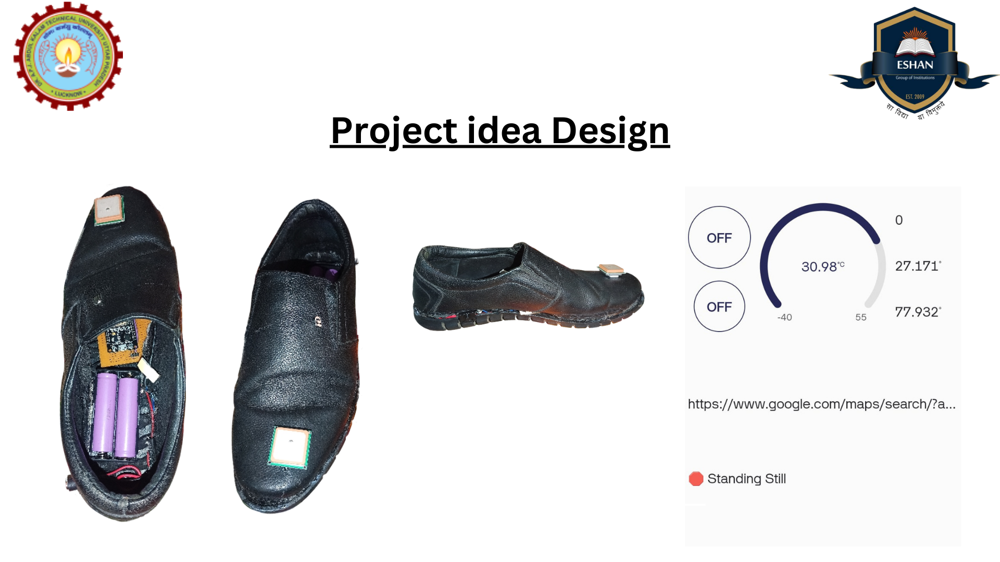

# **Smart Shoe with GPS, MPU6050, and Vibration Motor**  

This project integrates an **MPU6050 Accelerometer & Gyroscope**, a **GPS module**, and a **vibration motor** into a smart shoe system. The **ESP32** connects to WiFi to fetch precise location details using the **OpenStreetMap API** and detects walking patterns, running, standing still, and abnormal walking behavior.  

## **🛠 Features**  
✅ **Vibration Motor Activation** (Runs for 2 sec at startup)  
✅ **Step Detection & Counting** using MPU6050  
✅ **Walking, Running, & Standing Still Detection**  
✅ **Abnormal Walking Pattern Detection** (Falls, limping, etc.)  
✅ **GPS Location Tracking** (Latitude & Longitude)  
✅ **Full Address Retrieval** from OpenStreetMap API  

---

## **🖥️ Hardware Requirements**  
- **ESP32** (WiFi-enabled microcontroller)  
- **MPU6050** (Accelerometer & Gyroscope)  
- **GPS Module** (NEO-6M or similar)  
- **Vibration Motor** (Small DC motor)  
- **Jumper Wires**  

---

## **🔌 Pin Configuration**  

| Component        | ESP32 Pin  |  
|----------------|-----------|  
| **MPU6050 SDA** | GPIO 21  |  
| **MPU6050 SCL** | GPIO 22  |  
| **GPS TX**      | GPIO 16  |  
| **GPS RX**      | GPIO 17  |  
| **Vibration Motor** | GPIO 2 |  

---

## **📦 Libraries Required**  
Before uploading the code, install these libraries in **Arduino IDE**:  

1️⃣ **MPU6050** → **[Install from Arduino Library Manager]**  
2️⃣ **TinyGPS++** → **[Install from Arduino Library Manager]**  
3️⃣ **WiFi.h** (Built-in for ESP32)  
4️⃣ **HTTPClient.h** (Built-in for ESP32)  
5️⃣ **ArduinoJson** → **[Install from Arduino Library Manager]**  

---

## **🚀 Setup Instructions**  

### **Step 1: Connect Hardware**  
- **Connect the MPU6050**, GPS module, and vibration motor according to the pin configuration.  

### **Step 2: Update WiFi & API Key**  
- Open the `smart_shoe.ino` file.  
- Replace these placeholders in the code with your actual details:  

```cpp
const char* ssid = "YOUR_WIFI_SSID";  
const char* password = "YOUR_WIFI_PASSWORD";  
String API_KEY = "YOUR_OPENSTREET_API_KEY";  
```

### **Step 3: Upload the Code**  
- **Select Board** → ESP32 Dev Module  
- **Select Port** → COM Port of ESP32  
- **Click Upload**  

### **Step 4: Open Serial Monitor**  
- Set **Baud Rate to 115200**  
- Observe **Step Count, Activity Detection, GPS Coordinates, and Full Address**  

---

## **📌 Expected Serial Monitor Output**  
```plaintext
Connecting to WiFi...
WiFi Connected!
MPU6050 connected!
Vibration motor activated for 2 seconds...

=================================
Activity: 🚶 Walking
Step Count: 1
=================================
Live GPS Location: 28.7041, 77.1025
📍 Full Address:
Connaught Place, New Delhi, India
=================================
Activity: 🏃 Running
Step Count: 3
=================================
⚠️ Abnormal Walking Detected!
```

---

## **🌍 API Used**  
- **OpenStreetMap Nominatim API** to get full location address from GPS coordinates.  
- **Example API Request:**  
  ```
  https://nominatim.openstreetmap.org/reverse?lat=28.7041&lon=77.1025&format=json
  ```
- Returns JSON response with a **precise location name**.  

---

## **🛠 Future Improvements**  
🚀 Add **Blynk App Integration** for real-time monitoring.  
🚀 Implement **LoRa Communication** to send data over long distances.  
🚀 Add **Fall Detection System** for elderly users.  

## 📱 Contact me for support:
<div align="center">
  
<a href="https://www.linkedin.com/in/abhishek-kaushik-b677a2260/" target="_blank"></a>
<a href="https://www.x.com/Abhishek_9900" target="_blank"></a>
<a href="mailto:panditak095@gmail.com"></a>
<a href="https://www.facebook.com/Abhishek.Kaushik0" target="_blank"></a>
<a href="https://www.instagram.com/rangbaaz_abhishek__/" target="_blank"></a> 
<a href="https://wa.me/917017212992?text=Hello%2C%20I%20want%20to%20connect%20with%20you!" target="_blank"></a>
<br>
[](https://github.com/Abhi999k/Smart_shoes)

[](https://github.com/Abhi999k/Smart_shoes)

<br>


  

[](LICENSE)
</div>

 
